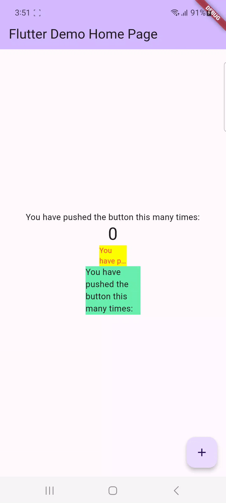

# Praktikum Pertemuan 10

**Amalia Salsa Lutfiana**

**3F/04/2141720228**

Langkah 2: Menambahkan Plugin

.png)

Langkah 3 : Buat file red_text_widget.dart

.png)

Langkah 4 : Tambah Widget AtoSizeText

.png)

Kode diatas eror karena pada file tersebut belum ditambahkan parameter text dalam konstruktor RedTextWidget, yang mana pada widget 'AutoSizeText' tidak mendefinisikan 'text' sebelum digunakan. 

Perbaikan Langkah 4

.png)

Langkah 5 : Buat Variabel text dan parameter di constructor

.png)

Langkah 6 : Tambahkan widget di main.dart

.png)
.png)

# Tugas

1. Selesaikan Praktikum tersebut, lalu dokumentasikan dan push ke repository Anda berupa screenshot hasil pekerjaan beserta penjelasannya di file README.md!

2. Jelaskan maksud dari langkah 2 pada praktikum tersebut!

Dengan melakukan 'flutter pub add auto_size_text' pada terminal dapat menambahkan plugin pada proyek yang dapat berfungsi untuk membuat teks dalam flutter dan dengan otomatis dapat melakukan penyesuaian ukurannya dengan ruang yang ada.Dengan plugin "auto_size_text" juga memberi kemungkinan teks melakukan penyesuaian terhadap ukuran termasuk lebar tinggi dan ukuran font pada widget, sehingga membuat teks tetap terbaca bahkan saat widget berubah ukuran.

3. Jelaskan maksud dari langkah 5 pada praktikum tersebut!

Dengan ditambahkannya variabel text dan parameter pada constructor, 'final String text' memiliki fungsi sebagai penampung teks yang kelak akan ditampilkan oleh widget. Dengan variabel 'final' membuat nilai yang ditetapkan pada constructor tidak dapat dirubah lagi. Sedangkan pada 'const RedTextWidget({Key? key, required this.text}) : super(key: key);' akan menerima nilai pada parameter 'text' yang telah di set 'required' sehinngga membuat nilai bersifat wajib untuk diinputkan.

4. Pada langkah 6 terdapat dua widget yang ditambahkan jelaskan fungsi dan perbedaannya!

Perbedaan dari kedua Container tersebut ada pada warna, lebar, dan widget turunan. Pada container pertama warna yang diinputkan yaitu kuning (Colors.yellowAccent) sedangkan pada container kedua yaitu warna hijau (Colors.greenAccent). Ukuran lebar pada container pertama diatur 50 piksel, sedangkan pada container kedua diatur 100 piksel. Pada container pertama memiliki widget turunan 'const RedTextWidget' yang menerima parameter 'text' yang berfungsi untuk menampilkan teks berwarna merah, sedangkan pada container kedua memiliki widget turunan 'const Text' yang berdungsi untuk menampilkan teks tanpa memiliki warna khusus.

5. Jelaskan maksud dari tiap parameter yang ada di dalam plugin auto_size_text berdasarkan tautan pada dokumentasi ini!

    a)  Parameter Key* : Melakukan identifikasi pada widget lainnya terhadap tree flutter

    b) Parameter Style* : Menentukan gaya pada teks dari mulai ukuran, warna, dan lain sebagainya.

    c) Parameter MinFontSze : Minimum ukuran pada font yang akan digunakan untuk melakukan penyesuaian terhadap ukuran teks

    d) Parameter MaxFontSize : Maksimum ukuran pada font yang akan digunakan untuk melakukan penyesuaian terhadap ukuran teks

    e) Parameter StepGranularity : Melakukan Penyesuaian pada ukuran teks pada widget

    f) Parameter PresetFontsizes : Membantu dalam penggunaan ukuran teks dengan ukuran font bawaan

    g) Parameter Group : Melakukan pengelompokan terhadap beberapa widget untuk menyesuaikan ukuran teks pada AutoSizeText

    h) Parameter TextAlign : Meratakan teks pada 'left', 'right', 'horizontal' dsb

    i) Parameter TextDirection : Menentukan start atau mulai teks, seperti 'TextAlign.start' (kiri ke kanan) atau 'TextAlign.end' (kanan ke kiri)

    j) Parameter Locale* : Melakukan pemilihan lokasi dalam penulisan teks

    k) Parameter SoftWrap* : Melakukan penentuan terhadap kelipatan baris teks yang tidak memiliki cukup ruang

    l) Parameter WrapWords : Melakukan penentuan terhadap lingkup baris berikutnya yang tidak memiliki cukup ruang

    m) Parameter Overflow* : Menampilkan titik titik pada teks yang terpotong

    n) Parameter OverflowReplacement : Menampilkan widget alternatif untuk menggantikan teks yang terpotong dan tidak termuat dalam batasan

    o) Parameter TextScaleFactor* : Menampilkan widget alternatif untuk menggantikan teks yang terpotong dan tidak termuat dalam widget

    p) Parameter MaxLines : Maksimum jumlah pada baris teks yang akan ditampilkan

    q) Parameter SemanticsLabel* : Memiliki posisi sebagai aksesbilitas pada layar

6. Kumpulkan laporan praktikum Anda berupa link repository GitHub ke spreadsheet yang telah disediakan!
