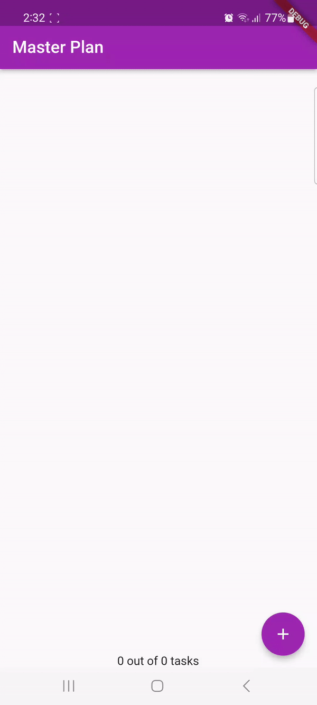
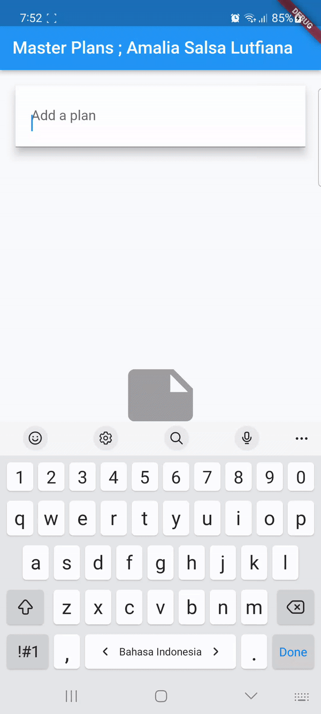

# Praktikum Week 11

Amalia Salsa Lutfiana

3F/04/2141720228

## Praktikum 1

1. Selesaikan langkah-langkah praktikum tersebut, lalu dokumentasikan berupa GIF hasil akhir praktikum beserta penjelasannya di file README.md!

Langkah 9

Langkah 13

2. Jelaskan maksud dari langkah 4 pada praktikum tersebut! Mengapa dilakukan demikian?

Pada langhkah 4 dilakukan export agar dapat memberikan izin akses sebuah kode terhadap file dart yang lain,sehingga kode pada file export tersebut dapat digunakan dalam file yang mengimpor sesuatu dari file export tersebut.

3. Mengapa perlu variabel plan di langkah 6 pada praktikum 
tersebut? Mengapa dibuat konstanta ?

Tujuan dari ditambahkannya variabel plan adalah agar objek 'Plan' pada kelas '_PlanScreenState' dapat diakses dan dapat digunakan di dalam metode 'build'. Alasan untuk inisilalisasi objek 'olan' dengan konstanta karena objek ingin ditetapkan secara statis dan tidak berubah.

4. Lakukan capture hasil dari Langkah 9 berupa GIF, kemudian jelaskan apa yang telah Anda buat!

Sampai di langkah 9 output yang dihasilkan yaitu berupa tampilan textfield beserta kolom check yang mana pada output akan terjadi auto scroll-up ketika textfield yang akan diinputkan data tertutup oleh keyboard.

5. Apa kegunaan method pada Langkah 11 dan 13 dalam lifecyle state ?

**Langkah 11**

Dengan  diimplementasikannya metode 'initState()' berfungsi sebagai inisiallisasi dari suatu objek. Kode pada langkah tersebut secara umum bertujuan untuk mengatur objek 'ScrollController' serta bertujuan untuk memastikan titik ketepatan.

**Langkah 13**

Metode 'dispose()' ditambahkan dengan fungsi untuk membersihkan objek 'ScrollController', serta untuk menhindari masalah kerja yang timbul disaat objek 'state' tidak sedang digunakan serta memastikan data yang digunakan efisien dan sesuai.

6. Kumpulkan laporan praktikum Anda berupa link commit atau repository GitHub ke spreadsheet yang telah disediakan!

## Praktikum 2

1. Selesaikan langkah-langkah praktikum tersebut, lalu dokumentasikan berupa GIF hasil akhir praktikum beserta penjelasannya di file README.md! Jika Anda menemukan ada yang error atau tidak berjalan dengan baik, silakan diperbaiki sesuai dengan tujuan aplikasi tersebut dibuat.

2. Jelaskan mana yang dimaksud InheritedWidget pada langkah 1 tersebut! Mengapa yang digunakan InheritedNotifier?

Pada kode yang terdapat pada langkah 1 InheritedWidget diwakilkan oleh PlanProvider yang berfungsi sebagai provider sehingga nilai pada ValueNotifier<Plan> dapat diakses. Alasan menggunakan InheritedNotifier agar widget yang masih ada dibawah lingkupnya dapat secara otomatis dilakukan rebulid dan memberikan kemungkinan terhadap pembaruan tampilan saat 'Plan' berubah.

3. Jelaskan maksud dari method di langkah 3 pada praktikum tersebut! Mengapa dilakukan demikian?

Pada langkah 3 terdapat 'int get completedCount' yang berfungsi mengembalikan nilai dengan menghitung berapa banyak data yang ditambahkan dalam daftar. Sedangkan pada 'String get completenessMessage' berfungsi mengembalikan pesan yang menyatakan berapa banyak nilai total yang ada. Dilakukan demikian supaya memberikan kemudahan pengguna dalam melakukan format informasi jumlah data yang telah diinputkan atau sejauh mana data telah diinputkan.

4. Lakukan capture hasil dari Langkah 9 berupa GIF, kemudian jelaskan apa yang telah Anda buat!

Pada output praktikum ini menampilkan jumlah data yang telah ditambahkan dan berapa data yang telah diisi pada bagian bottom

5. Kumpulkan laporan praktikum Anda berupa link commit atau repository GitHub ke spreadsheet yang telah disediakan!

## Praktikum 3

1. Selesaikan langkah-langkah praktikum tersebut, lalu dokumentasikan berupa GIF hasil akhir praktikum beserta penjelasannya di file README.md! 

2. Jika Anda menemukan ada yang error atau tidak berjalan dengan baik, silakan diperbaiki sesuai dengan tujuan aplikasi tersebut dibuat.

3. Berdasarkan Praktikum 3 yang telah Anda lakukan, jelaskan maksud dari gambar diagram berikut ini!

Pada gambar dapat dijelaskan bahwa PlanProvider merupakan turunan dari MaterialApp. Jika PlanProvider diposisikan pada tingkatan rendah dalam tingkatan widget lalu mendorong sebuah rute baru, maka datanya tidak akan dapat diakses oleh widget berikutnya. Jadi jika terdapat data yang perlu diakses, akan lebih baik jika data tersebut ditempatkan pada tingkatan yang lebih tinggi dalam tingkatan widget tepat diatas Navigator sehingga data akan tetap tersedia walaupun telah berpindah layar. Penempatan widget ini juga memiliki pengaruh tambahan terhadap pembaharuan aplikasi tanpa perlu adanya tambahan kode. 

4. Lakukan capture hasil dari Langkah 14 berupa GIF, kemudian jelaskan apa yang telah Anda buat!

5. Kumpulkan laporan praktikum Anda berupa link commit atau repository GitHub ke spreadsheet yang telah disediakan!