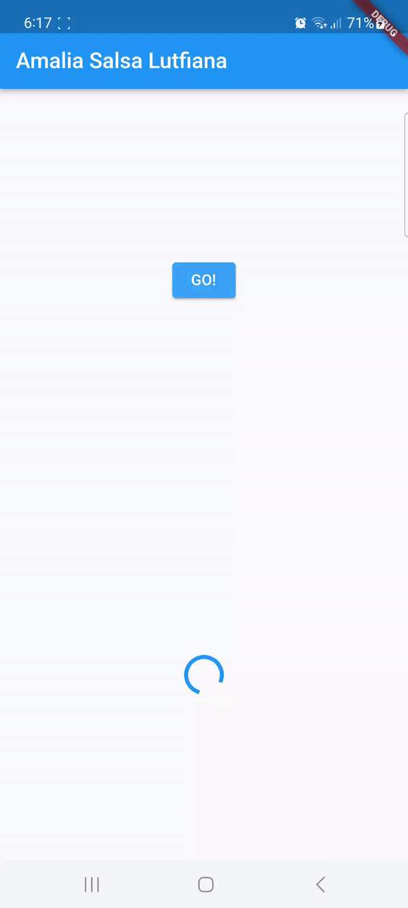

# Praktikum 12

Amalia Salsa Lutfiana

3F/04/2141720228

**Soal 1**

Tambahkan nama panggilan Anda pada title app sebagai identitas hasil pekerjaan Anda.

**Soal 2**

Carilah judul buku favorit Anda di Google Books, lalu ganti ID buku pada variabel path di kode tersebut. Caranya ambil di URL browser Anda seperti gambar berikut ini.

.png)

Kemudian cobalah akses di browser URI tersebut dengan lengkap seperti ini. Jika menampilkan data JSON, maka Anda telah berhasil. Lakukan capture milik Anda dan tulis di README pada laporan praktikum. Lalu lakukan commit dengan pesan "W12: Soal 2".

.png)

**Soal 3**

Jelaskan maksud kode langkah 5 tersebut terkait substring dan catchError!

kode substring pada langkah 5 berfungsi untuk mengambil sebagian dari string yang mana setelah dilakuka pengambilan data akan disimpan dalam variabel result. Sedangkan kode catchError pada langkah 5 berfungsi untuk menyelesaikan error saat fungsi dijalankan.

Capture hasil praktikum Anda berupa GIF dan lampirkan di README. Lalu lakukan commit dengan pesan "W12: Soal 3".

**Soal 4**

Jelaskan maksud kode langkah 1 dan 2 tersebut!

Pada Langkah 1 dan 2 dalam Praktikum 2 ini memiliki 3 fungsi yang mana memberikan penundaan selama 3 detik sebelum menampilkan nilai. Sedangkan pada praktikum 2 melakukan penjumlahan terhadap total yang telah disimpan.

Capture hasil praktikum Anda berupa GIF dan lampirkan di README. Lalu lakukan commit dengan pesan "W12: Soal 4".

**Soal 5**

Jelaskan maksud kode langkah 2 tersebut!

Pada Langkah 2 terdapat getNumber() yang berfungsi untuk memulai operasi dan mengembalikan nilai untuk hasil akhir. Sedangkan pada fungsi calculate() berfungsi melakukan perhitungan dan menyelesaikan fitur saat perhitungan selesai.

Capture hasil praktikum Anda berupa GIF dan lampirkan di README. Lalu lakukan commit dengan pesan "W12: Soal 5".

**Soal 6**

Jelaskan maksud perbedaan kode langkah 2 dengan langkah 5-6 tersebut!

Perbedaan pada langkah-langkah tersebut terdapat pada cara penyelesaiannya, yang mana pada langkah 2 diselesaikan menggnakan completer sekali setelah melakukan perhitungan 42. Sedangkan pada langkah 5-6 menggunakan try-catch yang berfungsi untuk mememastikan completer dengan dilakukan beberapa pemanggilan

Capture hasil praktikum Anda berupa GIF dan lampirkan di README. Lalu lakukan commit dengan pesan "W12: Soal 6".

**Soal 7**

Capture hasil praktikum Anda berupa GIF dan lampirkan di README. Lalu lakukan commit dengan pesan "W12: Soal 7".

**Soal 8**

Jelaskan maksud perbedaan kode langkah 1 dan 4!

Pada langkah 1 menggunakan FutureGroup menyediakan cara yang terstruktur untuk menangani sekelompok future. Sedangkan pada langkah 4 menggunakan Future.wait() berfungsi menunggu future dan mengambil data future

**Soal 9**

Capture hasil praktikum Anda berupa GIF dan lampirkan di README. Lalu lakukan commit dengan pesan "W12: Soal 9".

**Soal 10**

Panggil method handleError() tersebut di ElevatedButton, lalu run. Apa hasilnya? Jelaskan perbedaan kode langkah 1 dan 4!

Perbedaan pada kedua langkah tersebut yaitu berada pada penanganan eror. Yang mana pada langkah 1, method returnError() tidak menangani error yang terjadi. Jika error terjadi, maka method tersebut akan berhenti dan tidak mengembalikan nilai apapun. Sedangkan pada langkah 4, method handleError() menangani error yang terjadi dengan menggunakan try-catch. Pada try block, method handleError() mencoba menjalankan method returnError(). Jika error terjadi, maka try block akan berhenti dan error akan ditangkap oleh catch block. Pada catch block, method handleError() akan menampilkan error ke layar menggunakan print(). 

**Soal 11**
Tambahkan nama panggilan Anda pada tiap properti title sebagai identitas pekerjaan Anda.

**Soal 12**

Jika Anda tidak melihat animasi loading tampil, kemungkinan itu berjalan sangat cepat. Tambahkan delay pada method getPosition() dengan kode await Future.delayed(const Duration(seconds: 3));

Apakah Anda mendapatkan koordinat GPS ketika run di browser? Mengapa demikian?

Iya, hal ini dapat terjadi karena menggunakan API Geolocation dari google untuk mendapatkan informasi lokasi, Jika telah mengaktifkan izin lokasi dan GPS maka google akan mendapatkan informasi yang dibutuhkan.

Capture hasil praktikum Anda berupa GIF dan lampirkan di README. Lalu lakukan commit dengan pesan "W12: Soal 12".

**Soal 13**

Apakah ada perbedaan UI dengan praktikum sebelumnya? Mengapa demikian?

Kduanya sama-sama menampilkan koordinat geolokasi dengan layout yang sama, karena keduanya mengambil lokasi pengguna secara langsung.

Capture hasil praktikum Anda berupa GIF dan lampirkan di README. Lalu lakukan commit dengan pesan "W12: Soal 13".

Seperti yang Anda lihat, menggunakan FutureBuilder lebih efisien, clean, dan reactive dengan Future bersama UI.

Untuk pembaruan UI, pada kasus pertama, setState digunakan untuk memperbarui variabel state myPosition. Pada kasus kedua, FutureBuilder digunakan untuk mengelola pembaruan UI secara otomatis. Namun pada akhirnya, hasil tampilan UI terlihat sama karena keduanya memiliki penundaan yang sama, yakni 3 detik.

**Soal 14**

Apakah ada perbedaan UI dengan langkah sebelumnya? Mengapa demikian?

Kduanya sama-sama menampilkan koordinat geolokasi dengan layout yang sama, karena keduanya mengambil lokasi pengguna secara langsung.

Capture hasil praktikum Anda berupa GIF dan lampirkan di README. Lalu lakukan commit dengan pesan "W12: Soal 14".

**Soal 15**

Tambahkan nama panggilan Anda pada tiap properti title sebagai identitas pekerjaan Anda.

Silakan ganti dengan warna tema favorit Anda.

**Soal 16**

Cobalah klik setiap button, apa yang terjadi ? Mengapa demikian ?

warna akan berubah sesuai dengan warna yang telah ditetapkan pada widget ElevatedButton() di class navigation_second.dart, karena setiap tombol memiliki fungsi Navigation.pop() yang memiliki parameter berupa context dan warna yang telah ditetapkan.

Gantilah 3 warna pada langkah 5 dengan warna favorit Anda!

Capture hasil praktikum Anda berupa GIF dan lampirkan di README. Lalu lakukan commit dengan pesan "W12: Soal 16".

**Soal 17**

Cobalah klik setiap button, apa yang terjadi ? Mengapa demikian ?

Karena "Change Color" dan memilih warna pada dialog, layar akan mengalami perubahan pada warna latar belakang.Hal ini disebabkan karena warna dalam fungsi _showColorDialog, diikuti dengan pembaruan widget menggunakan setState. Tindakan ini akan memicu pembangunan ulang widget dan mencerminkan perubahan warna yang telah dipilih pada

Gantilah 3 warna pada langkah 3 dengan warna favorit Anda!
Capture hasil praktikum Anda berupa GIF dan lampirkan di README. Lalu lakukan commit dengan pesan "W12: Soal 17".

