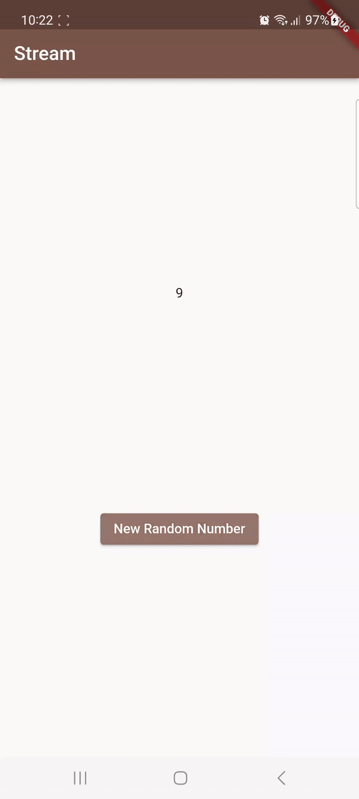
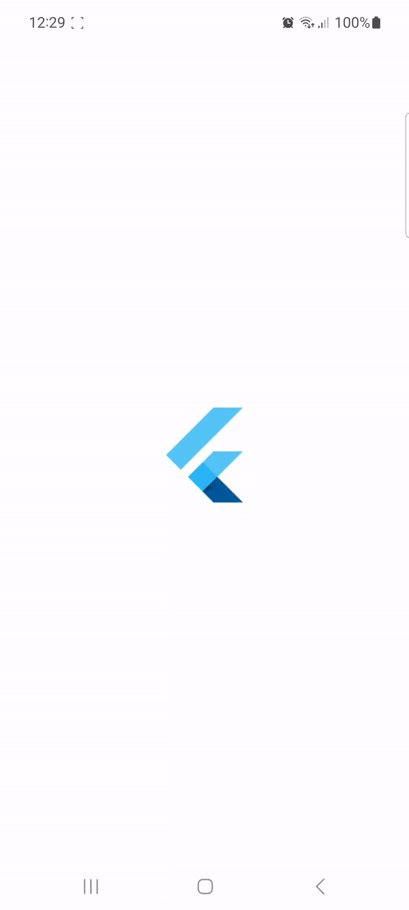
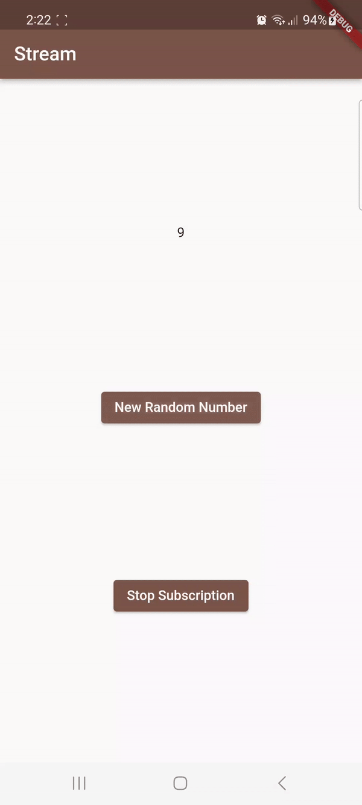
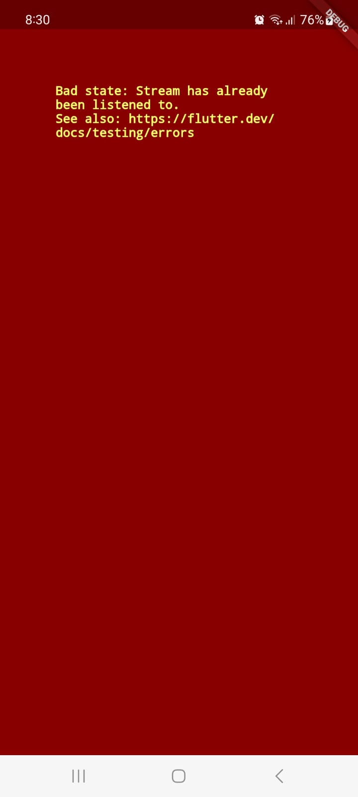

# Praktikum 13

Amalia Salsa Lutfiana
3F/04/2141720228

**Soal 3**

1. Jelaskan fungsi keyword yield* pada kode tersebut!

Kode yield sendiri berfungsi untuk menghasilkan nilai dari suatu stream. yang mana mada kode diatas berfungsi untuk menggabungkan hasil dari suatu stream ke dalam stream yang tengah didefinisikan untuk menghasilkan sebuah nilai.

2. Apa maksud isi perintah kode tersebut?

- yield* = digunakan untuk menghasilkan nilai dari suatu stream
- Stream.periodic = menghasilkan suatu stream yang mengeluarkan nilai pada waktu tertentu
- (int t) { = memberikan logika untuk menghasilkan nilai
- colors[index] = nilai yang dihasilkan pada setiap iterasi, dan nilai ini kemudian di-"yield" ke stream utama

**Soal 4**

Capture hasil praktikum Anda berupa GIF dan lampirkan di README.

**Soal 5**

Jelaskan perbedaan menggunakan listen dan await for (langkah 9) !

Pada kode tersebut, listen diguanakan untuk menangkap perubahan pada suatu stream. listen sendiri merupakan metode dari Stream untuk mendaftarkan fungsi callback yang dipanggil setiap kali ada data yang dikirimkan melalui stream.

Sedangkan await for digunakan untuk mengonsumsi suatu stream secara langsung untuk menghasilkan sebuah nilai dengan menunggu satu per satu.

**Soal 6**
1. Jelaskan maksud kode langkah 8 dan 10 tersebut!

Pada Langkah 8 memiliki Controller yang berfungsi mengontrol aliran data pasa stream. yang  kemudian pada stream.listen((event)) dilakukan pemanggilan metode listen untuk menangkap perubahan, sehingga ketika ada perubahan widget akan langsung diperbarui.

Pada langkah 9, kode yang ditambahkan digunakan untuk melakukan pembersihan terhadap daya saat widget dihapus atau sedang tidak digunakan

Pada lagkah 10 secara keseluruhan berfungsi untuk menghasilkan bilangan bulat secara acak dan menambahkannya yang kemudia diakses oleh widget yang merespons.

2. Capture hasil praktikum Anda berupa GIF dan lampirkan di README.

**Soal 7**

1. Jelaskan maksud kode langkah 13 sampai 15 tersebut!

Pada langkah 13 dtambahkan untuk memberikan pesan error terhadap sink yang masih terikat dengan controller

Pada langkah 14 menambahkan handler untuk mengatasi kesalahan yang terjadi, yang mana jika ditemukan kesalahan maka kode dalam 'onError' akan dipanggil

Pada langkah 15 jika kode tersebut dilakukan comment terhadap kode yang menghasilkan angka acak 0 dan 9. Dengan ditambahkannya 'numberStream.addError();' bertujuan untuk menambahkan pesan error jika terdapat suatu kesalahann atau kondisi yang tidak diinginkan.

2. Kembalikan kode seperti semula pada Langkah 15, comment addError() agar Anda dapat melanjutkan ke praktikum 3 berikutnya.

3. Lalu lakukan commit dengan pesan "W13: Jawaban Soal 7".

**Soal 8**

1. Jelaskan maksud kode langkah 1-3 tersebut!

Pada langkah 1 ditambahkan kode diatas berfungsi untuk mengubah atau memanipulasi aliran data yang diterima dari objek 'Stream'

Pada langkah 2 tersebut didefinisikan bagaiman aliran tipe int dapat diubah, yang mana nilai tersebut dikalikan dengan angka 10 lalu ditambahkan ke dalam sink dan jika ditemukan kesalahan,-1 akan dikirimkan ke sink, jadi ketika aliran selesai maka akan langsung ditutup 

Pada langkah ke 3 ditambahkan kode berikut bertujuan untuk mengambil aliran data pada numberStreamController menggunakan transformer untuk kemudian menamngkap perubahan pada aliran  data yang telah diubah

2. Capture hasil praktikum Anda berupa GIF dan lampirkan di README.

**Soal 9**

1. Jelaskan maksud kode langkah 2, 6 dan 8 tersebut!

Pada Langkah ke 2 data akan dikendalikan oleh numberStreamController yang mana nilai akan dilakukan perubahan dan pembaharuan pada lastNumber

Pada Langkah ke 6 kode tersebut digunakan untuk membatalkan atau menghentikan subscription terhadap stream yang sebelumnya telah dibuat.

Pada Langkah ke 8 dengan fungsi addRandomNumber() berguna untuk menambahkan angka acak ke dalam aliran data yang masih dikelola oleh numberStream setelah melalui pemeriksaan apakan controller sudah tidak dapat menerima yang baru.

2. Capture hasil praktikum Anda berupa GIF dan lampirkan di README.

**Soal 10**

Jelaskan mengapa error itu bisa terjadi ?

Pada langkah ini terdapat penggunaan variabel 'values' untuk menyimpan nilai stream dan ketika ditambahkan subscription2 lalu melakukan listen pada stream untuk kedua kalinya, hal ini dapat menyebabkan konflik dalam mengelola nilai values.

